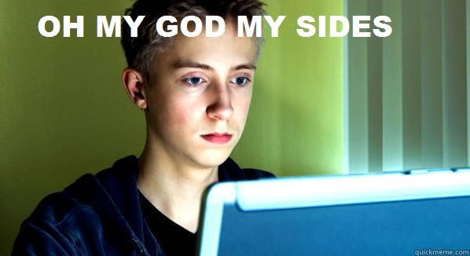

emote-acronyms
==============

Let's be honest.  Usually "lol" is more like this:
.

This repo is meant to document a more verbose, sincere, and thus more productive list of emote acronyms.  By abandoning the practice of typing acronyms describe behavior contrary to reality, we become better people, and we make the world a better place.

As the list grows and changes, we'll offer examples here, while the Master List will live [on the wiki](https://github.com/hitjim/emote-acronyms/wiki).

Thanks!!
Jim Rice
saa-ws (stands at attention - while saluting)
